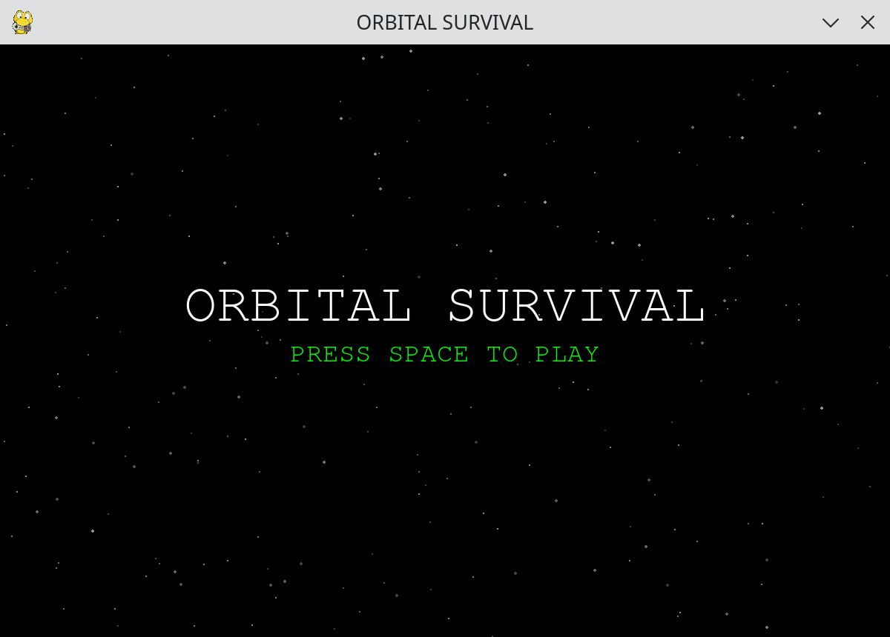
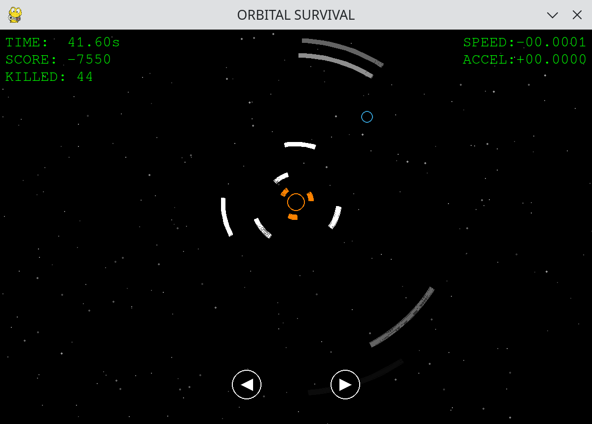

# Orbital Survival

A 2D survival game set in space.  
Control your planet, dodge rotating star beams, and survive as long as possible.




## Overview

You orbit around the center while a star emits beam attacks.  
Your goal is to avoid collisions and keep your score growing.

## Features

- Planet movement with acceleration + friction
- Randomized star rotation and beam firing
- Real-time HUD (speed, acceleration, score, collision count, elapsed time)
- Keyboard and mouse support

## Requirements

- Python 3.12+
- uv

## Installation

```bash
uv sync
```

## Run

```bash
uv run python main.py
```

## Controls

- Left arrow key: accelerate left
- Right arrow key: accelerate right
- Mouse: click and hold the on-screen left/right buttons

## Scoring

- Dodge a beam: `+10`
- Get hit by a beam: `-200` and collision count (`KILLED`) increases by 1

## Project Structure

```text
.
├── .gitignore
├── .python-version
├── __init__.py
├── config.py
├── entities
│  ├── __init__.py
│  ├── base.py
│  ├── beam.py
│  ├── planet.py
│  └── star.py
├── game.py
├── img
│  ├── Play.png
│  └── Start.png
├── main.py
├── pyproject.toml
├── README.md
├── system
│  ├── __init__.py
│  ├── base_manager.py
│  ├── logic.py
│  ├── play
│  │  ├── __init__.py
│  │  ├── play_manager.py
│  │  └── ui
│  │     ├── __init__.py
│  │     ├── hud.py
│  │     └── play_button.py
│  └── start
│     ├── __init__.py
│     ├── start_manager.py
│     └── ui
│        ├── __init__.py
│        └── start_button.py
└── uv.lock
```
