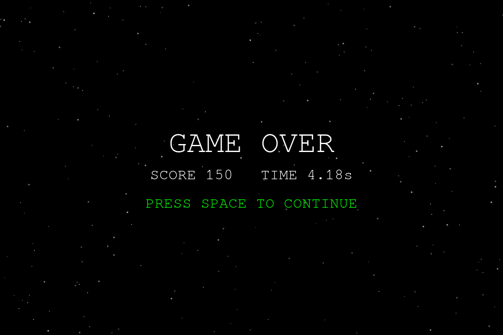

# Orbital Survival

A 2D survival game set in space.  
Control your planet, dodge rotating star beams, and survive as long as possible.




## Overview

You orbit around the center while a star emits beam attacks.  
You start with three lives and lose one on every hit. When the last one is
gone the run ends, so your score is a record of how long you lasted.

## Features

- Planet movement with acceleration + friction
- Randomized star rotation and beam firing
- Real-time HUD (speed, acceleration, score, remaining lives, elapsed time)
- Optional telemetry graph, plotting speed, acceleration and input over time
- Keyboard and mouse support

## Requirements

- Python 3.12+
- uv

## Installation

```bash
uv sync
```

## Run

```bash
uv run orbital-survival           # play
uv run orbital-survival --graph   # play, with the telemetry graph
```

## Development

```bash
uv run mypy                # type check (strict)
uv run ruff check --fix    # lint
uv run ruff format         # format
```

## Controls

- Left arrow key: accelerate left
- Right arrow key: accelerate right
- Mouse: click and hold the on-screen left/right buttons
- Space: start a run from the title screen, and return there after a game over

## Rules

- You start with 3 lives, set by `MAX_LIVES` in `config.py`
- Dodge a beam: `+10` score
- Get hit by a beam: lose one life. The score is never docked
- Lives reach 0: **GAME OVER**. Press space to return to the title

Hits are resolved per beam with no window of invincibility, so two beams
arriving on the same frame cost two lives.

The HUD shows the lives you have left as red hearts. Raise `MAX_LIVES` above
five and the row collapses to a `♥ x N` count instead.

## Telemetry Graph

`--graph` opens a second window plotting the last five seconds of the round:
speed, acceleration and the direction that reached the physics, stacked on a
shared time axis.

The vertical scales are fixed rather than fitted to the data, so the baseline
never moves and a glance tells you how close to terminal velocity you are.
Every bound is derived from the tuning constants, so editing `ACCELERATION`
or `FRICTION` rescales the axes automatically.

`INPUT` plots the direction the planet actually received, not the keys held.
The two differ when both arrows are down, which resolves to left.

Three constants in `config.py` control it:

| Constant | Meaning |
| --- | --- |
| `GRAPH_HISTORY_FRAMES` | Frames kept and plotted. The history is stretched across a fixed-width window, so raising it buys more time rather than a wider window. |
| `GRAPH_DRAW_INTERVAL` | Frames between repaints. Sampling always happens every frame, so this trades only smoothness for cost. |
| `GRAPH_WIDTH` / `GRAPH_HEIGHT` | Size of the graph window. |

Closing the graph window leaves the game running; it stays closed until the
next launch. The graph holds its last picture between rounds, so the run that
just ended is still readable on the game-over screen.

## Project Structure

```text
.
├── img
│  ├── GameOver.png
│  ├── Play.png
│  └── Start.png
├── src
│  └── orbital_survival
│     ├── __init__.py
│     ├── __main__.py          # console-script entry point
│     ├── config.py            # tuning constants
│     ├── game.py              # window, main loop, scene switching
│     ├── logic.py             # physics, collisions, lives and scoring
│     ├── entities
│     │  ├── base.py           # CelestialBody / BaseArc
│     │  ├── beam.py           # Beam, BeamCorpse
│     │  ├── planet.py
│     │  └── star.py
│     ├── scenes
│     │  ├── base.py           # Scene, GameMode, SceneRequest
│     │  ├── game_over.py
│     │  ├── play.py
│     │  └── start.py
│     └── ui
│        ├── graph.py            # telemetry recorder and its window
│        ├── hud.py
│        └── play_button.py
├── pyproject.toml
├── README.md
└── uv.lock
```
